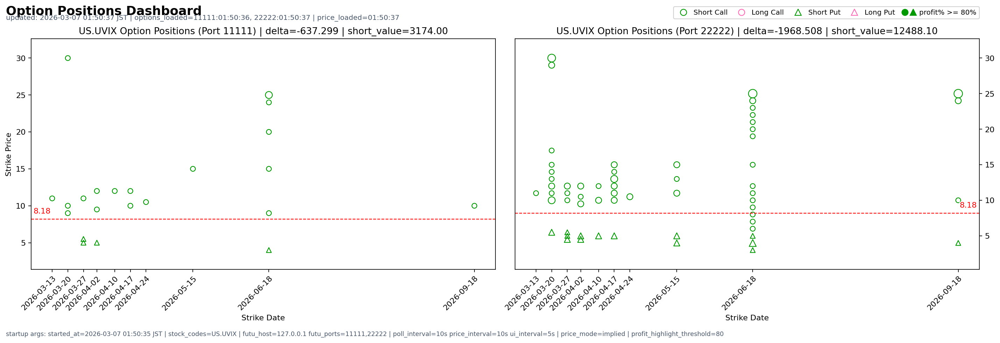
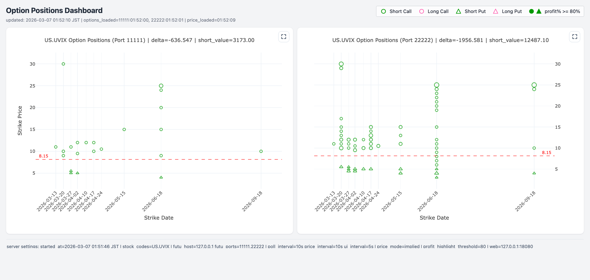

# opdash

Options position dashboard and plotting tool.

## Contents

- `opdash.py`: Matplotlib GUI visualization script (existing)
- `opdash_web.py`: web dashboard entry
- `backend.py`, `core.py`: shared backend logic for GUI/Web
- `web/index.html`, `web/styles.css`, `web/app.js`: standalone web page assets
- `options.py`, `positions.py`, `stocks.py`: required local modules
- `docs/screenshots/`: README screenshots for GUI/Web examples
- [`docs/usage.md`](docs/usage.md): detailed usage guide for both GUI and Web entries

## Data Source Support

- Currently only supports `futu-api`: https://openapi.futunn.com/futu-api-doc/en/intro/intro.html
- You must start and log in to Futu OpenD before running, otherwise the program cannot request quote/position data.
- If you want to compare two ports (for example `11111,11112`), run two OpenD instances and make each instance listen on a different port.
- Official OpenD startup docs:
  - Visual OpenD: https://openapi.futunn.com/futu-api-doc/quick/opend-base.html
  - Command Line OpenD: https://openapi.futunn.com/futu-api-doc/opend/opend-cmd.html

## Quick Start

```bash
python -m venv .venv
source .venv/bin/activate
pip install -r requirements.txt
```

All commands below assume the virtual environment is already activated and OpenD is already running.

GUI example:

```bash
python opdash.py US.UVIX --port 11111,22222
```

Hong Kong stock examples:

```bash
python opdash.py HK.00700 --port 11111,22222 --profit_highlight_threshold 70
python opdash.py HK.TCH --port 11111,22222 --profit_highlight_threshold 70
```



Web example:

```bash
python opdash_web.py US.UVIX --port 11111,22222
```

Then open `http://127.0.0.1:18080` in your browser.



Telegram alert example:

```bash
python opdash_web.py US.AAPL \
  --telegram_bot_token <BOT_TOKEN> \
  --telegram_chat_id <CHAT_ID>
```

## Detailed Usage

For full CLI arguments, more examples, runtime behavior, and troubleshooting, see [docs/usage.md](docs/usage.md).
