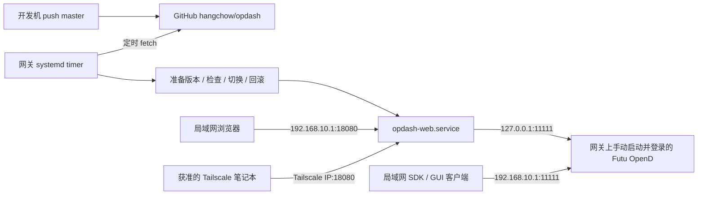

# Ubuntu 网关部署与自动更新方案

设计目标：将 `origin/master` 的 Web 仪表盘部署到 `192.168.10.1`，局域网访问地址为 `http://192.168.10.1:18080`，指定笔记本通过 Tailscale 访问 `http://<网关的 Tailscale IP>:18080`；推送到远端 master 后自动发布，失败恢复上一个可用版本。

目标主机为 `ssh osaka`（sean 用户），实际 LAN 地址为 `192.168.10.1/24`、接口 `enp9s0f0np0`，系统 Ubuntu 26.04 x86_64、Python 3.14.4、内存约 15 GiB。原需求中的 `192.168.0.1` 已按实机修正。以下记录设计及落地配置；部署程序位于 `deploy/`。

## 1. 推荐架构

采用 **Python venv + systemd 服务 + systemd timer 主动拉取更新**。适合一台常开、运行网关业务的 Ubuntu 主机，不需要为部署开放公网入口。



默认每轮更新任务结束后等待 60 秒再检查；部署延迟包含轮询、依赖准备和启动检查时间。自动部署只由远端 master 的提交变化触发，本地编辑和未 push 的提交不触发。

OpenD 保持网关开机后手动启动的方式，Web 固定连接 `127.0.0.1:11111`。OpenD 监听 `0.0.0.0:11111`，防火墙允许本机以及 `enp9s0f0np0` 上来自 `192.168.10.0/24`、目标为 `192.168.10.1` 的 TCP 11111 请求，其他非回环访问丢弃。局域网 SDK / GUI 客户端连接 `192.168.10.1:11111`；浏览器访问 Web 的 `18080` 端口。配置和验证记录见第 12 节。

暂不引入 Docker、反向代理和常驻 CI runner。若以后需要域名、HTTPS、登录认证或更低的切换中断，再扩展反向代理层。

## 2. 当前代码对部署的约束

| 现状 | 设计处理 |
| --- | --- |
| `opdash_web.py` 在 `main()` 中创建后端和 FastAPI app | 直接执行 Python 入口；单进程，不使用 reload 或多个 worker，避免重复行情连接与轮询 |
| `--host` / `--port` 是 OpenD，`--web_host` / `--web_port` 是 HTTP | 两组配置分开，HTTP 绑定 `0.0.0.0:18080`，由防火墙限定 LAN 和指定 Tailscale 设备 |
| Web 先启动 HTTP，再在后台连接 OpenD 和加载数据 | 连接或查询失败时页面仍能显示原因；`/readyz` 保持 503，发布检查期限为 120 秒 |
| `/healthz` 返回存活状态和发布 SHA，`/readyz` 返回数据就绪状态 | 部署时同时校验存活、目标版本和数据成功刷新 |
| Web 自动发现模式允许启动时空仓，成功轮询为空会清空旧面板 | 空仓也能就绪，后续持仓变化自动发现；GUI 初始解析保留原行为 |
| 所有 OpenD 端口共享一个 `--host`，最多两个端口 | 配置必须符合此限制；不同主机的 OpenD 不在本次直接支持范围 |
| GUI 的 `requirements.txt` 与 Web 部署依赖分开 | Web 使用目标 Python 3.14 验证的 `requirements-web.lock` |
| Plotly 2.35.2 和许可证随版本本地发布 | 浏览器无需访问 Plotly CDN；app.js 和 CSS URL 携带发布 SHA |

上述改进已实现：Web 支持空仓启动并使用全部交易市场发现标的；新增 `/readyz`；`requirements-web.lock` 在目标 Python 3.14.4 上生成并验证；Plotly 及许可证保存在 `web/vendor/`。GUI 入口的初始标的解析方式保留。不能复用开发机 macOS 的 `.venv`。

## 3. 运行目录与权限

```text
/opt/opdash/
  releases/<commit-sha>/       # 完整代码、web 资源、该版本独立的 .venv
  current -> releases/<sha>   # 当前运行版本
  previous -> releases/<sha>  # 上一个成功版本
/var/lib/opdash-deploy/
  repo.git/                  # 拉取用 Git 缓存
  state.json                 # 成功/失败 SHA、重试时间、发布事务状态
  deploy.lock                # timer 与手工发布共用锁
/etc/opdash/opdash.env        # OpenD、HTTP、轮询等环境配置，不进入发布目录
/usr/local/libexec/opdash/    # 管理员安装的启动、部署和回滚程序
/etc/systemd/system/          # opdash-web.service / opdash-deploy.service / timer
```

运行用户 `opdash` 只读取代码和配置，日志写入 journal；需要的 SDK 日志/缓存使用独立可写状态目录。部署用户 `opdash-deploy` 负责拉取、构建及版本目录，不以 root 安装 Python 依赖。运行用户不可读取 Git 私钥，也不可修改版本、配置或 systemd unit。

首次由管理员安装服务、固定的启动/部署程序及必要的最小权限规则。部署用户只获准通过固定命令重启、查询 `opdash-web.service`，不能执行任意 sudo 命令。自动更新不从仓库以 root 执行脚本，也不自动覆盖系统服务定义。

仓库已核实为公开仓库，网关使用 `https://github.com/hangchow/opdash.git` 匿名只读拉取，不存储 GitHub 凭据。若以后改为私有仓库，应改用仓库专用只读 Deploy Key。[GitHub 官方说明](https://docs.github.com/en/authentication/connecting-to-github-with-ssh/managing-deploy-keys)

## 4. 启动配置

配置使用已确认的网关本机 OpenD 地址：

```ini
FUTU_HOST=127.0.0.1
FUTU_PORTS=11111
WEB_HOST=0.0.0.0
WEB_CHECK_HOST=127.0.0.1
WEB_PORT=18080
POLL_INTERVAL=10
PRICE_INTERVAL=10
UI_INTERVAL=5
PRICE_MODE=auto
PROFIT_HIGHLIGHT_THRESHOLD=80
```

应用参数由固定启动程序 `deploy/start.py` 将环境变量转换成 CLI 参数，并通过 `exec` 启动当前版本，等价命令为：

```bash
/opt/opdash/current/.venv/bin/python -u /opt/opdash/current/opdash_web.py \
  --host 127.0.0.1 --port 11111 \
  --web_host 0.0.0.0 --web_port 18080 \
  --poll_interval 10 --price_interval 10 --ui_interval 5
```

此命令省略股票参数，Web 会自动发现期权标的；成功查询为空时也能启动。启动程序支持可选的 `STOCK_CODES`，使用参数数组传递。

服务启用开机启动，使用 `Restart=on-failure`、`RestartSec=15s`，设置合理停止超时。固定启动程序直接执行 Web，不再等待 OpenD TCP 端口；Web 在后台线程中连接 OpenD，并让 HTTP 页面立即可用。初始化抛错后每 5 秒重试；SDK 自身的连接重试也在后台进行，其握手错误会显示到页面。端口打开仅代表 TCP 可连接，登录/查询状态另行判断。`/healthz` 检查 HTTP 存活，`/readyz` 要求初始化完成、数据新鲜且没有当前 OpenD 错误。应用进程退出后由 systemd 限速重启。`network-online.target` 只提供启动顺序，不能保证 OpenD 已登录。

网关重启后的顺序为：systemd 启动 Web 页面并在后台等待连接 → 用户手动启动并登录 OpenD → Web 自动连接并加载数据。OpenD 不纳入自动部署或自动启动管理，Web 不对 OpenD unit 设置自动启动依赖，保留手动启动 OpenD 的顺序。等待期间浏览器可查看连接状态、失败原因及处理建议。

Web 限制为单核 CPU、1 GiB 内存；构建限制为单核 CPU、2 GiB 内存并降低 IO/CPU 调度优先级。版本保留与清理限制持续占盘；当前可用磁盘约 717 GiB。应用绑定所有 IPv4 地址，在独立防火墙 INPUT 链仅放行回环、指定 LAN 接口/网段，以及指定 Tailscale 设备到网关 Tailscale IP 的 HTTP 请求；其他接口/来源访问该端口一律丢弃。防火墙服务是 Web 的启动前置依赖。保留现有转发、NAT 和管理规则。

当前 HTTP 接口没有登录鉴权，能访问它的客户端可读取持仓数据。本方案访问范围为可信局域网及指定的 Tailscale 笔记本；Tailscale 访问同时受 tailnet 策略和主机规则约束。若需扩大到公网或其他用户，应先加入认证和 HTTPS。

## 5. 自动发布流程

1. 获取独占锁，检查暂停状态；对 Git、pip 和健康检查都设置超时。
2. `fetch` 远端 master 并解析出完整目标 SHA。与已成功版本相同则退出，不重启服务；网络错误保留当前版本，下轮重试。
3. 在新版本独立目录导出该 SHA 的完整代码。在最终路径创建独立 venv，按锁定文件安装依赖；不修改正在运行的 venv，也不移动已创建的 venv。
4. 完成语法编译、模块导入、依赖一致性及静态文件存在性检查。构建失败不切换；不得提前以生产 OpenD 配置启动第二个轮询进程。
5. 若当前服务或 OpenD 已处于异常状态，暂缓切换并记录依赖异常，避免将既有故障误判为新代码失败。开机后等待手动启动 OpenD 期间可 fetch/准备候选版本，但不切换；OpenD 就绪后再发布。首次部署没有当前服务时，用 15 秒超时的独立 SDK 探针验证行情/交易登录状态后进行首次启动；端口打开但等待短信验证时，只准备代码，不启动候选版本。
6. 持久化事务记录：旧 SHA、目标 SHA、阶段。停止旧服务，在同一文件系统以临时软链加 rename 原子替换 `current`，启动新服务。切换有短暂中断，不承诺零停机。
7. 在检查期限内验证 `/healthz`、首页、关键静态资源及 `/api/snapshot` 的有效 JSON 和字段结构，并确认服务持续存活。健康请求使用 `WEB_CHECK_HOST=127.0.0.1`，不依赖笔记本或 Tailscale 连接；未设置该变量且监听为 `0.0.0.0` 时也回退到回环地址。
8. 通过后更新成功状态和 `previous`。失败则恢复旧 `current`、重启旧版本并再次检查；首次部署没有旧版本时保留失败状态并报错。回滚也失败时保留诊断记录并停止自动切换。
9. 记录失败 SHA 并设置冷却期；构建或切换失败后对该 SHA 冷却 30 分钟，支持 `update --retry`；新 SHA 不受旧版本冷却限制。OpenD 未就绪时只保留已准备版本，不切换服务。
10. 保留最近 3 个成功版本，清理时始终保护 `current`、`previous` 和事务涉及的版本。任务中断或重启后先恢复未完成事务，再开始下一次发布。

上线门禁检查 `/healthz` 的发布 SHA、`/readyz` 和页面/快照/静态资源，连续通过三次才确认成功。`/readyz` 要求每个端口的持仓轮询成功且不陈旧，以及每个当前标的最近成功取得有效价格；阈值为 max(90 秒, 对应轮询间隔 × 3)。代码已核实持仓查询失败会抛错，不会刷新成功时间；额外记录每个标的成功取得价格的时间，避免某个标的持续失败被其他标的刷新掩盖。空仓只要求持仓查询成功。不要求价格持续变化，也不声称该接口校验所有期权 Greeks 的完整性。

timer 示例（配套 `opdash-deploy.service` 使用 `Type=oneshot`，不设 `RemainAfterExit=yes`）：

```ini
[Unit]
Description=Check opdash master updates

[Timer]
OnBootSec=2min
OnUnitInactiveSec=60s
AccuracySec=5s
Unit=opdash-deploy.service

[Install]
WantedBy=timers.target
```

`OnBootSec` 用于开机后检查，`OnUnitInactiveSec` 从上轮任务结束计时；已运行的同名任务不会由 timer 再启动一个实例。手工操作仍需共享文件锁。以上语义见 [systemd 官方 timer 文档源文件](https://github.com/systemd/systemd/blob/main/man/systemd.timer.xml)。

## 6. 运维与验收

日常状态与手动触发：

```bash
systemctl status opdash-web.service
journalctl -u opdash-web.service -n 100 --no-pager
journalctl -u opdash-deploy.service -n 100 --no-pager
systemctl list-timers opdash-deploy.timer
sudo systemctl start opdash-deploy.service
sudo systemctl disable --now opdash-deploy.timer
```

最后一条用于持久暂停自动更新，但不会终止已开始的发布；手工回滚必须等待任务完成并取得同一把锁。回滚命令应同时设置暂停状态，防止 timer 将版本马上重新升级。恢复自动更新时清除暂停状态并重新启用 timer。

| 验收场景 | 预期结果 |
| --- | --- |
| 首次发布 | LAN 可打开页面；实际 OpenD 持仓/行情可读取；记录成功 SHA |
| push 新提交到远端 master | 自动发现并发布新 SHA，页面/静态资源使用新版本 |
| 远端无变化 | 无重启、无重复安装依赖 |
| 依赖安装失败或 GitHub 断网 | 旧服务不受影响，日志包含失败阶段 |
| 新版本启动/接口失败 | 自动恢复上一个成功版本，失败 SHA 不触发连续重启 |
| 网关重启 | Web 等待本机 OpenD；手动启动并登录后自动恢复；timer 在依赖就绪前暂缓切换 |
| 发布进程中断 | 未完成事务可恢复；成功版本不被清理；timer 继续工作 |
| OpenD 离线、登录失效、空仓 | 明确显示/记录各自状态，不用空数据冒充查询成功 |
| WAN/访客网请求 HTTP 端口 | 被现有防火墙中的定向规则拒绝；原有网关业务正常 |
| 手工回滚 | 恢复指定成功版本且保持暂停自动更新 |

部署日志记录 SHA、阶段、耗时和错误，不输出密钥或完整持仓快照。

## 7. 实施文件清单与顺序

已增加 Web 依赖锁定文件、`deploy/start.py` / `deploy/deploy.py` / `deploy/install.sh`、Web/部署/timer/防火墙/OpenD unit、环境配置示例和测试；实现空仓启动、就绪状态和 Plotly 本地化。安装器中的 IP/接口配置针对 osaka，移植到其他主机前必须调整。

实施顺序：核实网关与 OpenD 环境 → 实现及验证部署文件和必要应用修改 → 首次手动发布并验收 → 验证失败回滚 → 启用 timer → 用一次 master 提交验证自动更新。

自动部署默认信任远端 master。建议 master 合并前执行适配目标 Python 的依赖安装与应用检查；如以后要求“CI 成功才发布”，需要额外验证目标 SHA 对应的 CI 状态或使用 CI 发布的版本清单，单纯 fetch 不会自动等待 CI。


## 8. OpenD 安装与登录

使用富途官方 Ubuntu 包中的命令行版 `10.10.7008`，安装于 `/opt/futu-opend/10.10.7008`，以 `futu-opend` 系统用户运行。API 监听 `0.0.0.0:11111`，由防火墙限定本机及指定局域网访问，Telnet/WebSocket 未启用。二进制和 XML 配置由 root 管理，SDK 自带的登录状态保存在该用户的私有 home `/var/lib/futu-opend`（0700）。`/etc/futu-opend/account.env` 只保存登录账号，权限 0640，组为 futu-opend；密码通过首次交互登录输入并由 OpenD 的“记住密码”功能保存，不进入仓库或进程参数。

新版首次登录可能要求短信验证码，由账户所有者完成。首次登录命令（先停止已有实例）：

```bash
sudo systemctl stop futu-opend
sudo -u futu-opend -H /opt/futu-opend/10.10.7008/FutuOpenD \
  -cfg_file=/etc/futu-opend/FutuOpenD.xml -no_monitor=1 -lang=en
```

依据原需求保留开机后手动启动 OpenD：安装 `futu-opend.service`，但不 enable；本次登录配置完成后启动它。之后使用：

```bash
sudo systemctl start futu-opend
sudo systemctl status futu-opend
sudo journalctl -u futu-opend -n 50 --no-pager
```

Web 和部署 timer 开机自动启动，等待 OpenD。若之后希望 OpenD 也随开机启动，可执行 `sudo systemctl enable futu-opend`。登录状态失效时需重新交互登录；自动部署不重启、升级或重新登录 OpenD。官方依据：[命令行安装及记住密码登录](https://openapi.futunn.com/futu-api-doc/opend/opend-cmd.html)、[短信验证命令](https://openapi.futunn.com/futu-api-doc/opend/opend-operate.html)。

## 9. 发布控制

所有发布控制命令使用同一把锁；普通管理用户通过 sudo 切换为部署用户：

```bash
sudo -u opdash-deploy -H python3 /usr/local/libexec/opdash/deploy.py status
sudo -u opdash-deploy -H python3 /usr/local/libexec/opdash/deploy.py pause
sudo -u opdash-deploy -H python3 /usr/local/libexec/opdash/deploy.py rollback
sudo -u opdash-deploy -H python3 /usr/local/libexec/opdash/deploy.py resume
sudo -u opdash-deploy -H python3 /usr/local/libexec/opdash/deploy.py update --retry
```

`rollback` 默认恢复 previous，也可追加保留的成功版本完整 SHA；回滚后保持暂停。`resume` 清除暂停并立即检查 master。如果曾 disable timer，另外运行 `sudo systemctl enable --now opdash-deploy.timer`。

若回滚未就绪，发布器暂停自动更新并保留事务。先修复 OpenD/服务依赖，再运行 `resume` 恢复旧版本和后续更新。不要手动删除状态文件或改动已发布版本的 venv。

Web 单元和 `/usr/local/libexec/opdash/` 程序由管理员安装，仓库更新不会自动覆盖它们；修改这些基础设施文件后，需要管理员重新执行经检查的安装脚本。应用、依赖锁定文件和前端资源会跟随 master 自动发布。

验证命令：`python -m unittest discover -s tests -v`；Web 测试需要先安装 Web 依赖。防火墙由独立 `inet opdash_guard` 表约束 18080 的 LAN 接口/网段和指定 Tailscale 设备，并将 11111 限制为本机及指定 LAN 接口/网段；另通过现有 UFW 放行相应的 HTTP 和 LAN OpenD 流量；不修改网关 NAT、转发及其他服务规则。


## 10. 实机验收记录（2026-09-12）

- 16 项测试通过，覆盖独立版本切换、失败回滚、事务恢复、失败冷却、OpenD 未登录等待、空仓及逐标的行情就绪。
- HTTP 冒烟检查通过：首页、健康接口、快照及本地 JS/CSS/Plotly 文件均能正常响应。
- OpenD 完成短信设备验证，并已验证切换到 systemd 后使用记住密码正常登录；未保存明文密码到仓库或启动参数。
- 首个成功版本 `846d5a8`；LAN 请求 `/healthz`、`/readyz` 返回 200，真实持仓与标的价格就绪。
- 首次部署时 OpenD 的 `11111` 仅监听回环地址，从 LAN 连接被阻止，Web 仅绑定 LAN 地址；后续 Tailscale 配置见第 11 节，OpenD 局域网开放见第 12 节。
- 服务开机配置：Web、部署 timer、防火墙已 enable；OpenD 仍为手动 start，符合原启动约定。

- 已验证真实 `master` 更新：推送 `1f67d58` 后，timer 自动完成独立版本构建与切换；无更新时 Web PID 保持不变。
- 无头 Chrome 验证本地 Plotly 正常加载、5 个面板成功绘图，没有加载或刷新错误。
- 已在真实服务上执行一次受控健康检查失败：候选版本正常启动后注入失败，发布器自动恢复原版本，重新通过真实 HTTP/数据就绪检查；未修改账户或应用代码。结果保存在部署状态的 `rollback_drill` 字段及 `opdash-rollback-drill.service` journal 中。
- 泄露检查覆盖本次部署提交及所有受 Git 跟踪的文件：未检出实际账号、密码、验证码、私钥、访问令牌或含凭据的 URL。`.gitignore` 已排除本地环境配置、OpenD 配置/登录状态、私钥和日志，配置示例仍可提交。

完整发布记录见 `/var/lib/opdash-deploy/state.json` 与 `journalctl -u opdash-deploy`。未重启整台网关，开机行为通过 systemd 配置和服务重启验证。Web 的持仓信息按设计可由获准的 LAN 和 Tailscale 客户端读取；仓库中的 LAN 地址和接口名属于部署配置，不是访问凭据。


## 11. Tailscale 直接访问

获准的笔记本连接网关同一 Tailscale 账号后，在浏览器直接打开：

```text
http://<网关的 Tailscale IPv4>:18080
```

无需 SSH 隧道、子网路由、出口节点或 Tailscale Serve。服务仍为单个 Web 进程，绑定 `0.0.0.0:18080`。管理员在网关本地 `/etc/opdash/firewall.nft` 中，仅放行 `tailscale0` 上来自指定笔记本 IP、目标为网关 Tailscale IP 的 TCP 18080 请求，并在现有 UFW 配置中添加同范围规则。其他 Tailscale 设备不自动获得访问权。OpenD 的 TCP 11111 允许本机和指定局域网访问，不经 Tailscale 开放。

具体设备地址及其防火墙白名单仅保存在主机本地，不提交到公开仓库。仓库中的默认防火墙仅对 LAN 开放 Web 18080，OpenD 11111 默认只允许本机；当前网关的 OpenD LAN 规则是第 12 节记录的主机本地配置。安装器会保留已有 `/etc/opdash/firewall.nft`，防止后续安装覆盖主机上的设备白名单和 OpenD LAN 规则。修改默认模板不会自动改变已有安装的规则，已有主机需要管理员审阅并更新本地文件。

若换用另一台笔记本，先在 `tailscale status` 中确认其属于同一账号，再更新主机本地 nft/UFW 规则中的客户端 IP。tailnet 的 ACL/grants 还必须允许该笔记本连接网关 TCP 18080。

既有安装的 `/etc/opdash/opdash.env` 需要明确设置 `WEB_HOST=0.0.0.0` 和 `WEB_CHECK_HOST=127.0.0.1`；安装器保留已有环境配置，不自动覆盖。先应用收窄来源的防火墙，再修改监听并重启 Web。此次已按此顺序应用，且从网关本机验证回环、LAN IP、Tailscale IP 的 `/readyz` 均返回成功；端到端验证需笔记本在线。


## 12. OpenD 局域网访问（2026-09-12）

已按要求将 `192.168.10.1:11111` 对 `192.168.10.0/24` 局域网开放。网关上的 Web 继续使用 `127.0.0.1:11111`；局域网 GUI 客户端可使用：

```bash
python opdash.py --host 192.168.10.1 --port 11111 --rsa_private_key .secrets/futu-opend-rsa.pem
```

持久配置如下：

- `/etc/futu-opend/FutuOpenD.xml` 的 `<ip>` 为 `0.0.0.0`，`<api_port>` 为 `11111`。
- `/etc/opdash/firewall.nft` 的 `inet opdash_guard` / `input` 链中，以下两条规则按顺序保留；第一条允许指定 LAN 流量，第二条丢弃其他非回环流量。现有 Web 和 Tailscale 规则保留。

```nft
tcp dport 11111 iifname "enp9s0f0np0" ip saddr 192.168.10.0/24 ip daddr 192.168.10.1 accept
tcp dport 11111 iifname != "lo" counter drop
```

UFW 同时增加了以下规则：

```bash
sudo ufw allow in on enp9s0f0np0 from 192.168.10.0/24 to 192.168.10.1 port 11111 proto tcp comment 'OpenD LAN'
```

实施时先通过 `nft -c -f` 检查候选规则，备份原配置，再应用 nft/UFW 规则，修改 OpenD 监听地址并重启 `futu-opend.service`。原 `firewall.nft` 和 `FutuOpenD.xml` 备份位于网关 `/etc/opdash/backups/lan-11111-20260912-020326-992292/`。OpenD 开机后手动启动的设置保留。

端口开放时的验证结果：从当前局域网客户端执行 `nc -vz -G 5 192.168.10.1 11111` 连接成功；网关 `ss` 显示 OpenD 监听 `0.0.0.0:11111`；OpenD、Web、防火墙服务均为 active；`http://127.0.0.1:18080/readyz` 返回 200，`ok`、`positions_ok`、`prices_ok` 均为 true。此阶段只覆盖 LAN TCP 连通性和网关仪表盘数据就绪，未覆盖远程 SDK 查询；后续持仓查询暴露的加密要求已按第 13 节处理，上面的客户端命令已更新为加密连接方式。


## 13. OpenD 协议加密（2026-09-12）

局域网直连持仓查询曾返回 `cross-network trade connections must be encrypted`。TCP 端口可达并不代表交易接口可用：持仓查询也属于交易接口，需要启用 OpenD 协议加密。OpenD 和 SDK 客户端使用同一份 RSA 私钥，初始化连接后使用协商的 AES 密钥传输请求和响应。官方说明：[协议加密配置](https://openapi.futunn.com/futu-api-doc/qa/other.html)、[协议流程](https://openapi.futunn.com/futu-api-doc/ftapi/protocol.html)、[Python SDK 设置](https://openapi.futunn.com/futu-api-doc/ftapi/init.html)。

已在本机生成 SDK 要求的 1024 位 PKCS#1 RSA 私钥，通过 SSH 传到网关。私钥文件不进入 Git：

- 本机：`.secrets/futu-opend-rsa.pem`，目录权限 0700、文件权限 0600。
- 网关：`/etc/futu-opend/keys/opdash-rsa.pem`，目录权限 0750、文件权限 0640，属主 root、组 futu-api。futu-opend、opdash、opdash-deploy 加入该组，以供 OpenD、仪表盘及首次部署探针读取。
- `/etc/futu-opend/FutuOpenD.xml` 增加 `<rsa_private_key>/etc/futu-opend/keys/opdash-rsa.pem</rsa_private_key>`。
- `/etc/opdash/opdash.env` 增加 `FUTU_RSA_PRIVATE_KEY=/etc/futu-opend/keys/opdash-rsa.pem`；Web 的 OpenD 地址仍为 `127.0.0.1:11111`。

GUI 和 Web 均新增 `--rsa_private_key` 参数，也支持 `FUTU_RSA_PRIVATE_KEY` 环境变量。显式参数优先；启动时先读取并校验私钥，再配置 SDK 加密，随后进行持仓自动发现。两个端口共用 SDK 的同一份私钥配置，因此对比两个 OpenD 实例时，两端必须配置相同的私钥。

独立 Python SDK 程序应在创建任何行情或交易连接之前执行：

```python
from futu import SysConfig

SysConfig.set_init_rsa_file("/absolute/path/to/futu-opend-rsa.pem")
SysConfig.enable_proto_encrypt(True)
```

网关的 `/usr/local/libexec/opdash/start.py` 已更新：设置私钥环境变量后，在发布版本的 venv 中先配置 SDK 加密，再运行 Web 入口；该方式兼容尚未支持新参数的保留版本，回滚应用版本后仍能连接已加密的 OpenD。`deploy.py` 的首次部署登录探针同步支持私钥配置。启用加密时先备份 OpenD XML、环境文件及两个启动/部署脚本，再在部署锁保护下更新配置、重启 OpenD 和 Web。备份位于 `/etc/opdash/backups/rsa-20260912-022508/`。

加密验收：从当前这台电脑通过 `192.168.10.1:11111` 建立加密行情连接，`get_global_state` 成功且行情已登录；通过加密交易连接执行 `position_list_query(refresh_cache=True)` 返回 `RET_OK`。未输出账户或持仓详情，未执行下单或解锁交易。重启后的网关仪表盘 `/readyz` 返回成功，持仓与行情均就绪。24 项测试通过，包含私钥校验、参数优先级、首次部署探针和旧版本启动加密兼容。


## 14. 页面显示 OpenD 错误

页面顶部新增 OpenD 状态区。连接拒绝、超时、`check sha error`、跨网络连接未加密、私钥无法读取，以及持仓/行情查询失败时，展示 OpenD 地址、失败阶段、原始错误、最近发生时间和处理建议。错误内容按纯文本渲染并限制长度，密码、令牌和私钥正文会脱敏；页面不展示完整日志或调用栈。

Web 的初始化和持仓自动发现移到后台；即使 SDK 一直重试握手，首页和 `/api/snapshot` 仍可用。运行期间查询失败会保留上次成功数据，状态区明确提示图表可能是旧数据。相同端口、相同阶段成功后清除该错误；某一端口恢复不会清除另一端口的错误。没有具体错误但数据过期时显示未就绪提示；浏览器刷新 API 失败也会显示提示并继续重试。

`/api/snapshot` 新增 `opend` 字段，状态为 `starting`、`error`、`stale` 或 `ready`。错误和恢复状态独立于图表版本更新，因此无需持仓或价格变化就能显示。`/readyz` 在初始化未完成、数据过期或存在当前错误时返回 503。

验证：33 项测试通过，覆盖初始化卡住时 HTTP 可用、具体 SDK 错误保留、分端口恢复、失败时保留旧数据、私钥错误、空仓和初始多端口发现。真实 Web 入口连接未监听的本机端口时，HTTP 正常响应并显示连接错误，进程可正常终止。Chrome 使用模拟握手失败验证了顶部错误区及恢复后自动隐藏。
